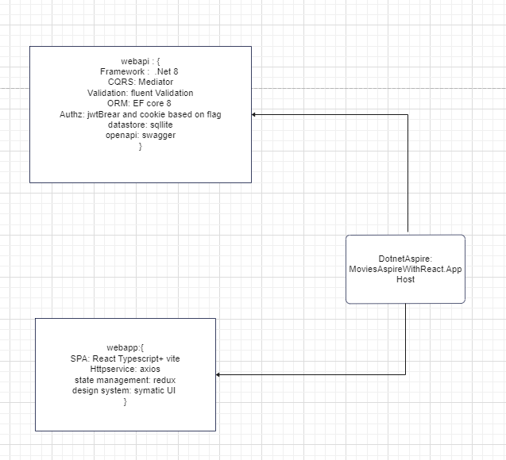

# Movie Project

# How to Run the project in local

1. Download git clone https://github.com/govindagoud-patil/MovieAspireWithReact.git
2. Navigate to webapp and restore deps (npm install)
3. Install docker desktop if not installed in you local machine
4. Navigate to MoviesAspireWithReact.AppHost and run "dotnet run" . that is it your app is up and running,It lauches aspire dashboard 
5. Navigate to React . It asks for login it is optinal just ignore and hit login button will take you to the movie list page where you can do CRUD opeartion on movie list
